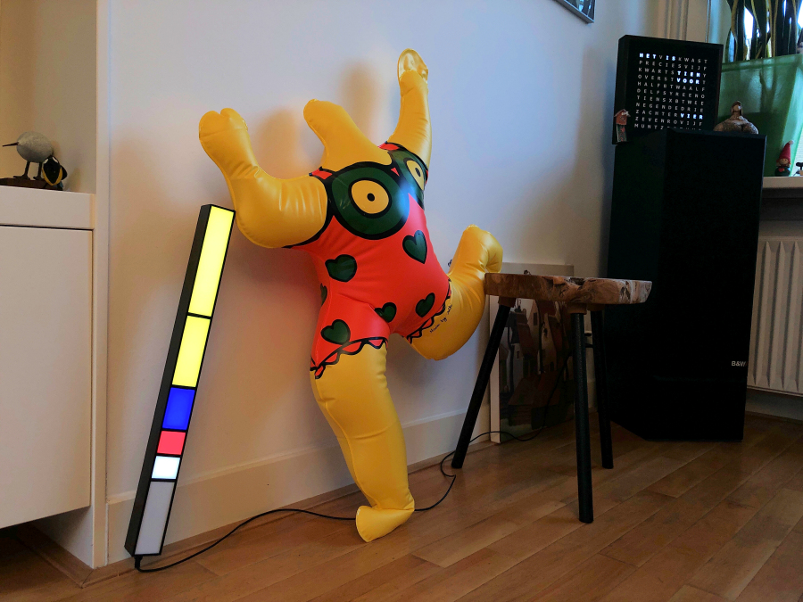
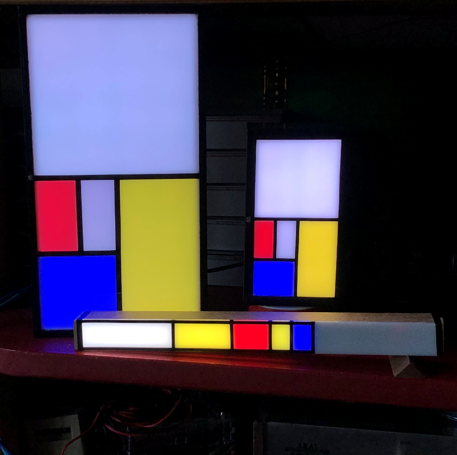

 # Fibonacci vierkante kokerklok (Fibonacci square tube clock)
Below an English desctiption

Fibonacci vierkante buisklok, of stokklok.

Deze vierkante kokerklok is een variatie op de [Fibonacciklokkast](https://ednieuw.home.xs4all.nl/Woordklok/FibonacciClock/Fibonacciklok.html)   
De software is vereenvoudigd en geschikt voor de WS2812- en SK6812-kleuren-LED's.

Een uitgebreide handleiding is [hier te vinden](https://ednieuw.home.xs4all.nl/Woordklok/FibonacciStick/Fibonaccistick.html)  

Gebruik Arduino
=============
Om de software te compileren zijn nodig de libraries:
- Adafruit Neopixel
- RTClib bij Adafruit
- Encoder by Paul Stofregen 
- Keypad by Mark Stanley, A Brevig (ipv de encoder)

In deze klok wordt gebruik gebruikt van kleuren en oppervlakten die de reeks van Fibonacci volgen.
Deze reeks is 1,1,2,3,5. De oppervlakten van de segmenten is de klok.  
Wat de klok doet is de verlichting aanzetten achter de vlakken die opgeteld 
moeten gaan worden.  
Om de uren en minuten te combineren wordt een derde kleur, blauw, gebruikt.  

De rode vlakken zijn de uren.  
De gele vlakken vermenigvuldigd met 5 zijn de minuten en
de blauwe vlakken als er een rode en gele hetzelfde vlak bezetten.  
De witte vlakken betekenen nul, die stellen niets voor met optellen.

Fibonacci was een Italiaanse wiskundige die de naar hem genoemde 
getallenreeks ontwikkelde. Het was niet een normale getallenreeks maar een die 
ook vaak in natuurlijke processen voorkomt. Bijvoorbeeld in zonnebloemen en 
schelpen.  
De reeks is simpel. Elk volgend getal in de reeks is de som van de twee 
voorgaande: 1, 1, 2, 3, 5, 8, ....   
Als wij 1, 1, 2, 3, 5 optellen komen wij op 12.  
Ah, precies het aantal uren in een dagdeel en 12 vermenigvuldigt met 5 is het 
aantal minuten in een uur.

Voorbeeld: 4 uur.  
Dat kan een optelsom zijn van : 1+1+2 of 1+3.  
Voorbeeld: 8 uur.  
Dat kan bereikt worden met het optellen van 1+1+2+4, of 1+3+4 of 3+5.  
De display van de klok is een weergave van de Fibonacci-reeks en de oppervlakte 
van de vlakken is de verhouding van de oppervlakte in de reeks.  
Als het nu duizelt is het goed.

Nog een voorbeeld. 3:35.  
Dat zijn drie rode (uren) vlakken en 35/5 = 7 gele (minuten) vlakken.  
Drie kan je maken met het 1 vlak + 2 vlak of alleen met het 3 vlak.  
Zeven kan zijn 1 + 1 + 5 of 2 + 5 of 1 + 1 + 2 + 3.  
3:35 tot en met 3:39 geven dezelfde 7 minutenvlakken maar de kloksoftware 
probeert elke minuut een andere combinatie te vinden. Dit gaat random dus het 
kan zijn dat hij weer dezelfde combinatie vindt en niet verspringt.

Hoe laat is het in de foto?  
- 1 x rood + 2 x blauw = 3 uur.  
- 3 x geel + 2 x blauw = 5 minuutsegmenten van 5 minuten = 25.  
-> Dus 3:25 maar het kan ook nog 3:29:59 zijn

Een gedetaileerde beschrijving hier: https://ednieuw.home.xs4all.nl/Woordklok/FibonacciStick/Fibonaccistick.html

 
# Detailed description 
This square case clock is a variation on the Fibonacci case clock. 
The software is simplified and suitable for two types of color LEDs.
The Fibonacci clock was a kick-starter project by Philippe Chrétien.

What makes this clock so attractive is its simplicity, ingenuity and the constantly changing Mondrian-like painting display.
Mondriaan was also looking for simplicity in his paintings, which started with realism and ended with his characteristic style via cubism.
In addition to the play of colors, this clock invites you to recalculate the time presented.
But a clock? And what does Fibonacci have to do with Mondrian?
The colored areas separated by black lines are immediately reminiscent of Piet Mondriaan's paintings when the primary colors red, yellow and blue are used.
 
This clock uses colors and surfaces that follow the Fibonacci sequence.

Red + Blue = hours, (Yellow + Blue) x 5 = minutes.
 
The stick above has 1 red + 2 blue areas = 3 o'clock
In addition, 3 + 5 = 8 yellow areas + 2 blue areas = 8 + 2 = 10 areas of 5 minutes = 10 x 5 = 50 minutes.
 
1 + 2 = 3 hours, (8 + 2) x 5 = 50 minutes It is 3:50, ten to four.
What the clock does is turn on the lighting behind the areas that are to be added.
A third color, blue, is used to combine the hours and minutes.
The red areas are the hours.
The yellow areas multiplied by 5 are the minutes and
the blue areas if there is a red and yellow one occupying the same area.
The white areas mean zero, they mean nothing with addition.
 
Fibonacci was an Italian mathematician who developed the series of numbers named after him. It was not a normal series of numbers, but one that also often occurs in natural processes. For example in sunflowers and shells.
The sequence is simple. Each subsequent number in the series is the sum of the two previous ones: 1, 1, 2, 3, 5, 8, ....
If we add 1, 1, 2, 3, 5 we get 12.
Ah, exactly the number of hours in a half day and 12 multiplied by 5 is the number of minutes in an hour.
 
Example: 4 hours.
This can be a sum of: 1+1+2 or 1+3.
Example: 8 hours.
This can be achieved by adding 1+1+2+4, or 1+3+4 or 3+5.
The clock's display is a representation of the Fibonacci sequence and the area of ​​the faces is the ratio of the area in the sequence. fibonacci clocks
 
If it's dizzy now, that's fine.
 
Another example. 3:35.
That is three red (hours) areas and 35/5 = 7 yellow (minutes) areas.
You can make three with the 1 plane + 2 plane or only with the 3 plane.
Seven can be 1 + 1 + 5 or 2 + 5 or 1 + 1 + 2 + 3.
3:35 to 3:39 give the same 7 minute segments, but the clock software tries to find a different combination every minute. This is random, so he may find the same combination again and not jump.
 
 
#The construction of the cabinet
The minimum space required to build the electronics in a cabinet is 25 x 25 x 100 mm internal dimensions if an Arduino Nano is used with the connection pins on one side.
Otherwise, make the cabinet a little higher and possibly wider to keep the side of the cabinet square
The strip has 12 LEDs per 20 cm (60 LEDs per meter). The smallest cabinet is therefore 30 cm long.
With a ready-made Arduino, like the one at the back of the photo below, the connection pins are at the top and bottom. This makes the case 15 mm higher.
Including the connecting wires, a cabinet of 40 mm wide or high is required.

The inside of the compartments where the lighting is on must be perfectly white.
For example, you can use white MDF for this.
But it can also be easily stuck by white paper to the inside of the compartments.
Thin, sturdy cardboard, MDF or other material can be used as a separation between the compartments. Do not make it thicker than 2 mm.
It is nice when the white perspex top plate falls into the wood.
To do this, use a saw table to cut a slot 1 mm deep in the side, 1-2 mm below the top at the thickness of the perspex sheet.
But of course it can also be stuck between the sides.

For the smallest cabinet with an LED strip of 60 LEDs per meter:
- Cut a strip for the bottom 25 mm wide and 300 mm long.
- Immediately saw a strip of 25 mm wide (maximum 2 mm thick) for the partitions for the compartments and saw the seven partitions to size (25x25mm).
If the compartment dividers are cut from cardboard, this can be done later.
- Saw two sides of 35 cm to a width of 25 mm + the thickness of the bottom plate.
- If necessary, saw out a slot just below the top edge into which the perspex can fall.
- Cut out the sides of the end edge with a width of 25 mm.
- Stick white paper on all partitions and sides of the cabinet where the lighting will be located.
- Glue the cabinet together except for one end edge. Useful! Use paper masking tape to keep the parts firmly clamped together.
- Stick the LED strip to the bottom from the glued end edge.
- Apply a drop of Bison sealant to the sides of the strip to prevent the side of the strip from curling up over the years.
- Install the electronics (see below) and glue the dividers in place.
- Finish the cabinet neatly if the electronics work properly.
- Tape the compartment divisions on the perspex with 2 mm wide black adhesive tape or draw the compartment divisions on the perspex with a black felt-tip pen for a better contrast between the light surfaces.

For the large 52 cm cabinet with an LED strip of 30 LEDs per meter:
The advantage of the larger cabinet is that a larger and more accurate DS3231 time module can be used.
The dimensions are then 40 x 40 mm per compartment and the length of the cabinet is 520 mm.
The LED strip then contains 30 LEDs per meter.

Assembling the electronics

The requirements for the electronics are shown below
A soldering iron is needed to solder three wires to the LED strip.
The light-sensitive sensor and the resistor should preferably also be soldered.
A multimeter costing 10 euros is useful to measure the resistances and check any bad connections.
 

Required:

- WS2812 or SK6812 LED strip with twelve LEDs
- Arduino Nano or Arduino Nano Every
- DS3231 RTC module.(1) DS3231 for Pi or DS3231 RTC
- 100 - 1000 uF capacitor
- 330 or 470 ohm resistance
- 22 Kohm resistance
- LDR (photosensitive resistor)
- Rotary encoder
- 9 Dupont cables female to female
- 4 Dupont cables male to female
- Insulating tape or shrink tubing with a diameter of approximately 2 mm
- A few pieces of wire
- Soldering iron and solder
(1) The smallest clock only fits the "DS3231 for Pi" clock module.

The connection diagram is drawn below.
The program to design these schemes can be downloaded from Fritzing
Click on the image for the design file that can be read and edited in the Fritzing program.

In software version V023, a flat 3-button membrane can also be used instead of the rotary.
If the membrane buttons are visible and horizontal then GND is the top wire.
 

Soldering the LEDs

- Apply solder to the three connections on the LED side where the GND connection is above.

Strip soldering

- Solder the three Dupont wires of approximately 5 cm in length.

Strip soldering

The resistor is an additional security and can be omitted if necessary.
- Cut the middle wire, connected to Di, and solder the 470 ohm resistor between it.
Di is "Data in" and Do on the other side of the LED is "Data out".
This is the signal wire that tells the LEDS what color they should adopt. In the LED you see the small chip that controls all this.

The capacitor can be omitted if necessary. The strip is relatively short and does not draw much current when switched on.
If the lighting is not constant and the light flashes, the capacitor can solve this. Probably a heavier diet too.
- Solder the capacitor to the GND and +5V connections. Longest leg of the capacitor at the 5V.
On the GND side, a gray line with - - on it should be visible on the capacitor.
The capacitor captures the wave of electrons that flow into the LED strip when the power is turned on.
The capacitor dampens this wave so that the LEDs are less stressed when turned on.

- Apply a drop of glue to the connection to prevent loosening.

The photo shows additional wires soldered. A GND (ground wire) can be used for the LDR connection.
There is a shortage of GND connections on the Arduino. The diagram shows that two wires go to the GND.
 

It is wise to label the wires. This prevents errors when connecting and is practical if something ever comes loose or needs to be replaced later.

- So label all wires as shown in the Fritzing design diagram above.

It is true that the DS3231 clock module is connected to 3.3V, but it can also be connected to 5V.
The rotary receives its power from a digital pin that is turned "on" in the software.
pinMode(EncoderPow, OUTPUT );
digitalWrite(EncoderPow,HIGH);There is then 5V on pin 2 and 20 mA current can be safely drawn from it
The clock could also be powered with a digital pin if the software is adjusted.

DS3231 Raspberry

- Connect the LED strip and possibly the LDR so that the electronics can be tested.
On the LED strip between GND and 5V the resistance is more than 1 Mohm (1 million ohms).
Between 5V and GND pins on the Arduino Nano it is more than 10 kOhm (10,000 Ohm).

- Connect the Rotary or membrane button and RTC clock module according to the diagram above.

Connections to Arduino

- Connect the USB plug to a 5V power supply.
Wait a few seconds. No burning smell and the LEDs light up?

## The software
### IDE preparation

- Download the Arduino IDE from: https://www.arduino.cc/en/Main/Software
Arduino IDE

The software uses libraries. This is software written by others that contains functions that would otherwise take you months to figure out and program. Now you can use that work that others have selected for you.

Libraries
The Arduino programming environment offers a wide range of libraries.
In order to adapt this Fibonacci clock software, the following libraries must be installed in the Arduino IDE:
this goes like this:
- In the IDE menu open: Sketch->Include library -> manage libraries
- Find the following libraries and install them
Adafruit Neopixel
Encoder by Paul Stofregen
Keypad by Mark Stanley, Alexander Brevig
RTClib at Adafruit
Another option is to copy all libraries from this ZIP file to the folder where the sketches are located.
In this sketch folder there is a folder "libraries". Copy the contents of the ZIP file into it.
There are many types of Arduinos. we use the Arduino Nano
In the menu: Tools -> board you can select the Arduino Nano
Under Processor, choose ATMEGA328p (Old bootloader)
board

To place the code in the Arduino Nano, an Arduino must be connected to the PC via a USB cable.
Port then turns black and a com port can be checked
If the arrow to the right under edit in the menu is then pressed, the program will be loaded into the Arduino nano.

## The program and its algorithms

The parts used can be selected with #define.
Placing two slashes // before a #define disables the option.
In the program, the pieces that code for a part can be recognized by the program lines between #ifdef and #endif.
The piece of code will not be compiled into the software if it is not defined with a #define.

#ifdef ROTARYMOD
#include <Encoder.h> // For rotary encoder
#endif ROTARYMOD

The software supports WS2812 or SK6812 LED strips. Choose one of these.
You can also choose between a rotary knob (ROTARYMOD) or a keypad (KEYPAD).

The clock can work without DS3231 time module. It then works with the processor's clock.
This processor clock has a deviation of seconds per day. This is only useful for testing the software.
A DS3231 module has a deviation of only one minute per year.
If #define MOD_DS3231 is disabled, the processor clock is used.
 
//--------------------------------------------
// ARDUINO Definition of installed modules
//--------------------------------------------
//#define LED2812            // Use  RGB LED strip WS2812
#define LED6812            // Use RGBW LED strip SK6812
#define ROTARYMOD          // Use rotary encoder
//#define KEYPAD             // Use a 3x4 keypad
#define MOD_DS3231         // DS3231 RTC module installed
//--------------------------------------------
// ARDUINO Includes defines and initialisations
//--------------------------------------------
                     #ifdef ROTARYMOD
#include <Encoder.h>             // For rotary encoder
                     #endif ROTARYMOD
#include <Wire.h>                // Communication with 
#include <RTClib.h>              // For RTC module
#include <EEPROM.h>              // To store data in EEPROM
#include <TimeLib.h>             // For time management  
#include <Adafruit_NeoPixel.h>   // for LED strip WS2812 or SK6812

                     #ifdef KEYPAD
#include <Keypad.h>               // For 3x4 keypad
                     #endif KEYPAD

"Pin Assigments" defines a readable name for a pin.
Digital pins can only be turned on or off or read.
At analog pins, voltages between 0 and 5 V can be measured or controlled with values ​​between 0 and 1024.//--------------------------------------------
// PIN Assigments
//-------------------------------------------- 

enum DigitalPinAssignments {
 EncoderPow   = 2,                // give power to Encoder
 clearButton  = 3,                // switch (labeled SW on decoder)
 encoderPinA  = 4,                // right (labeled DT on decoder)
 encoderPinB  = 5,                // left (labeled CLK on decoder)
 EmptyD06     = 6,                // EmptyD06
 EmptyD07     = 7,                // EmptyD07
 EmptyD08     = 8,                // EmptyD08 
 EmptyD09     = 9,                // EmptyD09 
 EmptyD10     = 10,               // EmptyD10                                 SS
 LED_PIN      = 11,               // Pin to control colour SK6812 WS2812 LEDs MOSI
 EmptyD12     = 12,               // EmptyD12                                 MISO 
 secondsPin   = 10};              // if set to 13 led will blink on board     SCK
                                  // Analogue hardware constants ----
enum AnaloguePinAssignments {
 PhotoCellPin  = 2,               // LDR pin
 EmptyA3       = 3,               // EmptyA3
 SDA_pin       = 4,               // SDA pin
 SCL_pin       = 5};              // SCL pin
 
After these "Pin Assigments", several definitions of variables follow in the software.
After the initializations, the Arduino will execute the setup() function.
Here, all kinds of functions of the libraries are enabled and the analog and digital pins are defined for input or output.
After setup(), the loop() function, as the name suggests, runs endlessly from start to finish in a loop.
This is the heart of the coding from which everything is controlled and calculated.
//--------------------------------------------
// ARDUINO Loop
//--------------------------------------------
void loop(void)
{
 SerialCheck();
 if(Demo)  Demomode();
 else
  { 
   EverySecondCheck();
   if(!KeyInputactivated) EveryMinuteUpdate();                      // if keyboard input then do not update display
                              #ifdef ROTARYMOD      
   RotaryEncoderCheck(); 
                              #endif ROTARYMOD 
  }
}  
//--------------------------------------------
// ARDUINO Setup initialise the hardware  
//--------------------------------------------
void setup()         // initialise the hardware // initialize the appropriate pins as outputs:
{
 Serial.begin(9600);                                               // setup the serial port to 9600 baud 

 pinMode(secondsPin,   OUTPUT );
                          #ifdef ROTARYMOD
 pinMode(encoderPinA,  INPUT_PULLUP);
 pinMode(encoderPinB,  INPUT_PULLUP);  
 pinMode(clearButton,  INPUT_PULLUP);
 pinMode(EncoderPow,   OUTPUT );
 digitalWrite(EncoderPow,HIGH);                                     // Provide the rotary encoder with power
 Tekstprintln("Rotary encoder enabled");
                          #endif ROTARYMOD

 strip.begin();                                                     // Start communication to LED strip
 strip.setBrightness(BRIGHTNESS);                                   // Set brightness of LEDs
 ShowLeds(); 
et cetera ......
 
 
The software quickly checks the loop to see whether anything is being entered serially, whether the demo mode is turned on and whether the dial is being turned.
Furthermore, there are actions once per second and once per minute that require the rest of the software's attention.
The light intensity of the LDR is read every second. This intensity is weighted with the previous reading so that the brightness of the LEDs is adjusted in a muted manner.
The reading of the LDR, which is between 0 and 1024, is taken by the square root so that the light intensity is adjusted parabolically.
The clock changes the time display every minute. Every minute the numbers 1,1,2,3,5 are randomly selected from an array and added up. If the value matches the desired value, these numbers are sent to the clock. A processor is so extremely fast that this method works more elegantly than putting all the options in a list. Especially when memory space is limited.
The color palettes are stored in an array colors[][].
For example pallette number 1:

{ white, red , yellow, blue },

//
#1 Mondrian

If a compartment must remain empty and has a value of zero, the color becomes white.

If there is a color for an hour, it will be red. If the minute needs to be colored
then the color becomes yellow. If the compartment is both red and yellow
the color becomes blue.

The variable bits[] keeps track of this. It can have the value 0, 1, 2 or three.

Service

The clock is operated with the rotary.

The rotary can be pressed and turned.

Pressing the button activates the button. After 60 seconds this becomes
deactivated again.

Press once to change the hours. The display becomes
then red. Turning the knob advances or rewinds the hours
put

A second press within 60 seconds turns the display yellow, followed by the minutes
can be adjusted.

A third press allows you to adjust the maximum brightness.

The various color plates can then be selected.

The settings are saved when the power is removed from the clock.

To reset the clock, press 20 times or more or press and hold
to hold.
 
switch (NoofRotaryPressed) // No of times the rotary is pressed
{
case 1: ChangeTime = true; ColorLeds("",0,NUM_LEDS-1,0XFF0000); ShowLeds(); delay(1000); break; // Change the hours RED 
case 2: ChangeTime = true; ColorLeds("",0,NUM_LEDS-1,0XFFFF00); ShowLeds(); delay(1000); break; // Change the minutes YELLOW 
case 3: ChangeLightIntensity = true; ColorLeds("",0,NUM_LEDS-1,0XFFFFFF); ShowLeds(); delay(1000); break; // Change intensity 
case 4: DisplayPalette = 1; break;
case 5: DisplayPalette = 2; break; 
case 6: DisplayPalette = 3; break;
case 7: DisplayPalette = 4; break;
case 8: DisplayPalette = 5; break;
case 9: DisplayPalette = 6; break; 
case 10: DisplayPalette = 7; break;
case 11: DisplayPalette = 8; break;
case 12: DisplayPalette = 9; break;
case 13: DisplayPalette = 0; break;
case 14 ... 19: break; 
default: NoofRotaryPressed = 0; Reset(); break; 
}
 
## Keypad
The 3x4 key keypad in the current software is too large to stick on the clock, but can be used for a cabinet.
## Serial control

Serial monitor
After the clock is connected to the PC with a serial cable, the clock can be controlled with the Arduino IDE software.
Entering 'i' brings up a menu in the "serial monitor" of the Arduino IDE.
The time and the measured light intensity are printed every thirty seconds.
With a connected DS3231 time module, the measured temperature +/-5C is also shown.

Sensor:683 Min:157 Max:736 Out: 41=16% Temp:22C
Sensor: is the current measurement between 0 and 1024 bits.
Min: is the lowest measured bits and Max: the highest.
Out: is the calculated light intensity (0-255). In this case 16%.

The menu after pressing I is as follows:
Enter Time as: hhmm (1321) or hhmmss (132145)
D for Demo mode
I for information
Lnn (L5) lowest intensity (1-255)
Mnn (M90) light intensity (1%-250%)
Pn (P1) to select a palette (0-9)
Max brightness: 20%
Min brightness: 10 bits
Number of LEDs: 12
The lowest light intensity sent to the clock can be set with L.
The clock will then not turn on softer than that value when it is completely dark.
L5 is a nice value.
The maximum strength can be set with M. Sometimes the clock is too bright or too dim for the place where it is located.
M80 is the default value.
The color palette can be selected with P. P1 is standard.
With D the clock goes into demo mode until D is entered again or the clock is turned off.
